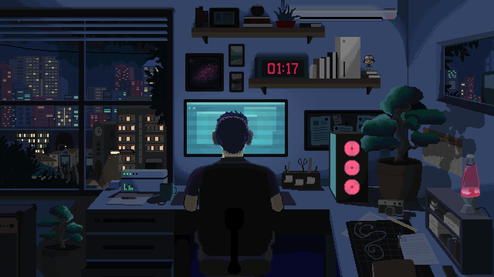

# Hola, soy Aritz 👋🏻

<!-- repo_count_starts -->
<!-- repo_count_ends -->

## Sobre mi 👨🏻‍💻
<!-- Texto sobre mi -->
Soy un desarrollador apasionado con un enfoque en el desarrollo web y la creación de aplicaciones multiplataforma. Me encanta la tecnología y estoy constantemente explorando nuevas herramientas, tecnologías y lenguajes para mejorar la calidad de mis proyectos.

## Lenguajes y Tecnologias 💻

![C#](https://img.shields.io/badge/C%23-%20?style=for-the-badge&logo=data:image/svg+xml;base64,PHN2ZyB4bWxucz0iaHR0cDovL3d3dy53My5vcmcvMjAwMC9zdmciIHhtbG5zOnhsaW5rPSJodHRwOi8vd3d3LnczLm9yZy8xOTk5L3hsaW5rIiB2aWV3Qm94PSIwLDAsMjU2LDI1NiIgd2lkdGg9IjEwMHB4IiBoZWlnaHQ9IjEwMHB4IiBmaWxsLXJ1bGU9Im5vbnplcm8iPjxnIGZpbGw9IiNmZmZmZmYiIGZpbGwtcnVsZT0ibm9uemVybyIgc3Ryb2tlPSJub25lIiBzdHJva2Utd2lkdGg9IjEiIHN0cm9rZS1saW5lY2FwPSJidXR0IiBzdHJva2UtbGluZWpvaW49Im1pdGVyIiBzdHJva2UtbWl0ZXJsaW1pdD0iMTAiIHN0cm9rZS1kYXNoYXJyYXk9IiIgc3Ryb2tlLWRhc2hvZmZzZXQ9IjAiIGZvbnQtZmFtaWx5PSJub25lIiBmb250LXdlaWdodD0ibm9uZSIgZm9udC1zaXplPSJub25lIiB0ZXh0LWFuY2hvcj0ibm9uZSIgc3R5bGU9Im1peC1ibGVuZC1tb2RlOiBub3JtYWwiPjxnIHRyYW5zZm9ybT0ic2NhbGUoNS4xMiw1LjEyKSI+PHBhdGggZD0iTTI1LDJjLTAuNzE0ODQsMCAtMS40Mjk2OSwwLjE3OTY5IC0yLjA2NjQxLDAuNTM5MDZsLTE2Ljg0Mzc1LDkuNDY0ODRjLTEuMjg5MDYsMC43MjI2NiAtMi4wODk4NCwyLjA3ODEzIC0yLjA4OTg0LDMuNTMxMjV2MTguOTI5NjljMCwxLjQ1MzEzIDAuODAwNzgsMi44MDg1OSAyLjA4OTg0LDMuNTMxMjVsMTYuODQzNzUsOS40NjQ4NGMwLjYzNjcyLDAuMzU5MzggMS4zNTE1NiwwLjUzOTA2IDIuMDY2NDEsMC41MzkwNmMwLjcxNDg0LDAgMS40Mjk2OSwtMC4xNzk2OSAyLjA2NjQxLC0wLjUzOTA2bDE2Ljg0Mzc1LC05LjQ2MDk0YzEuMjg5MDYsLTAuNzI2NTYgMi4wODk4NCwtMi4wODIwMyAyLjA4OTg0LC0zLjUzNTE2di0xOC45Mjk2OWMwLC0xLjQ1MzEyIC0wLjgwMDc4LC0yLjgwODU5IC0yLjA4OTg0LC0zLjUzMTI1bC0xNi44NDM3NSwtOS40NjQ4NGMtMC42MzY3MiwtMC4zNTkzNyAtMS4zNTE1NiwtMC41MzkwNiAtMi4wNjY0MSwtMC41MzkwNnpNMjUsMTNjMy43ODEyNSwwIDcuMjc3MzQsMS43NTM5MSA5LjU0Mjk3LDQuNzM4MjhsLTQuMzgyODEsMi41MzkwNmMtMS4zMTY0MSwtMS40NDE0MSAtMy4xODc1LC0yLjI3NzM0IC01LjE2MDE2LC0yLjI3NzM0Yy0zLjg1OTM3LDAgLTcsMy4xNDA2MyAtNyw3YzAsMy44NTkzOCAzLjE0MDYzLDcgNyw3YzEuOTcyNjYsMCAzLjg0Mzc1LC0wLjgzNTk0IDUuMTYwMTYsLTIuMjc3MzRsNC4zODI4MSwyLjUzOTA2Yy0yLjI2NTYyLDIuOTg0MzggLTUuNzYxNzIsNC43MzgyOCAtOS41NDI5Nyw0LjczODI4Yy02LjYxNzE5LDAgLTEyLC01LjM4MjgxIC0xMiwtMTJjMCwtNi42MTcxOSA1LjM4MjgxLC0xMiAxMiwtMTJ6TTM1LDIwaDJ2Mmgydi0yaDJ2MmgydjJoLTJ2MmgydjJoLTJ2MmgtMnYtMmgtMnYyaC0ydi0yaC0ydi0yaDJ2LTJoLTJ2LTJoMnpNMzcsMjR2Mmgydi0yeiI+PC9wYXRoPjwvZz48L2c+PC9zdmc+&logoColor=FFFFFF&color=%23512BD4)

![XML](https://img.shields.io/badge/XML-%20?style=for-the-badge&logo=data%3Aimage%2Fsvg%2Bxml%3Bbase64%2CPD94bWwgdmVyc2lvbj0iMS4wIiBlbmNvZGluZz0iVVRGLTgiPz4KPHN2ZyBpZD0iQ2FwYV8xIiBkYXRhLW5hbWU9IkNhcGEgMSIgeG1sbnM9Imh0dHA6Ly93d3cudzMub3JnLzIwMDAvc3ZnIiB4bWxuczp4bGluaz0iaHR0cDovL3d3dy53My5vcmcvMTk5OS94bGluayIgdmlld0JveD0iMCAwIDUxMiA1MTIiPgogIDxpbWFnZSB3aWR0aD0iOTYiIGhlaWdodD0iOTYiIHRyYW5zZm9ybT0ic2NhbGUoNS4zMykiIHhsaW5rOmhyZWY9ImRhdGE6aW1hZ2UvcG5nO2Jhc2U2NCxpVkJPUncwS0dnb0FBQUFOU1VoRVVnQUFBR0FBQUFCZ0NBWUFBQURpbUhjNEFBQUFDWEJJV1hNQUFBc1RBQUFMRXdFQW1wd1lBQUFFelVsRVFWUjRuTzJkeTZ0V1ZSakdkK1l4eXpSU0RNcUJRN01NSndaT0FuVVFZb2hKRUVLRU9vZ2dRZEtFckNZZlFTQjR2S1ZkY0JMMEQwU1RDc3ZBb2tHb0E3VUw0b1VzTXJFbWFwQjBqRjlzMnA0MkwrdXN0ZmJsWTcxcmZlc0haM0RXYlQvUGV2YlpsL1h0L1oyaXlHUXltVXdtazhsa01wbWVBUjRCOWdIZkFYK2lqMEdTb1FOandIN2dGdm9aRkFsTy9tZkV4YUJJaFdyUGo1RkJrY2d4UDRiRFRwb2hWQ2ZjMk5sVnhBcndQV2t3S0dJRXVFRTY3Q3BpdytWSXU3N29ROENCZG4zUmg0QUQ3ZnFpRHdFSDJ2VkZINExMZ1haOTBZZmdVcTlkWC9RaHVKUnIxeGQ5Q0M3VjJ2VkZINEpMc1haOTBZZmdVcXRkWC9RaHVKUnExeGQ5Q0M2VjJ2VkZINEpMb1haOVhRbnRMd2NRR3UxN0NFTW10TDhjUUdqVTd5R3ArMU12TUhWLzZnV203ays5d05qOUFZOEJCeFEvNnhtVVlVNzhYY0M3d0Q5aExlcG1tSlAvWldoem94ekFlNkdOeGNLd2p2bjVzQk13Z1BLRW13a1lRQ3JQZWtZYlFFclBla1laZ0l2bkRIMCtOclQ3eU5CdW82SGQvWWFmaGNDRVJjTkUxY2JVMXpwQkpCREFPV0M2NlBPa29kMHF3MnRNNTMwTkFGOWJOSHpscTcrRnYwYTBuMmxQQTFPd1dmUzVBL2l4VnY5RFdTYmF2TkRFQVBDNlpmdXYrZXB2NmMrYjlqUHRhV0FLZmdKbWlINWJhL1V2aWJvWndNVW1Cb0NsbHUwdjlkWGYwcDgzN1dmYTA0Q0ZGMFcvMmNBMTREb3dSOVJ0YVdNQXVHVG9jbG4rZGRuMGQvRG5SYnRadHB2MjVWZmdidEgzbmZLTlNWRTJFL2lsalFIZ3NLSEw0U2I2Ty9qem91aWJodHZmYW5oamNwRW8yK1pyQUpncmZuL2EwR1c5YURQUHByK2pQeWRGM3pUYy9tL0FQWmF4WmdGWGZBMEE2NEg3UlArYnRlWi9HK3JYMmZSMzlPZWtsMG52S0hDSFpheFhteGdBMXBiM0NxTHM4MXJ6THd6M0ZXdHQrbnZ3NTYyL0YxcG91RnJ1aVlaeDdnVitiMklBV0FFY3NSekNYaEYxUjRDVk52MDkrUFBXM3dzdE5KUTNWMk9HY2NvYnJ3dE5EQURMcXBYWUJiV3lSYlhtaTJ2bEQxWnY2Qyt6NmUvQm43ZitYbWloNFhuTFdKdWFHT0QveVg1WmxKZDMzeGRGMmZhcXJUenBXeWVvaFQ5di9iM1FjUHRuNWJLRUdPdk82cTdZeXdDd29DbytMc3JmQmc2SnNwTlYyNGRzK2p2NmM5SnBzcWVZdENZOEsvb3VCeDRYWlJ0OERRQnphbFdUZXphd0duaXE5dnZpV3J2Wk52MGQvVG5wYTk3YkNEd0ZUQk45UHdRK0VHWFRnTk0rQnZpdjdXM2VGRGR6azVlN3dGdTFkbEtEZFlMb21iN212WTFBZWYwOUgvaXJ1bTUvd0hCOWI4U3kvZk9tSllkcTRXOXlYY21sdjRNL0w0cSs4ZHp1Q2NOcTV4dTErcDJHY2IvMU1TQ3FseHZxbjJqUW55SDViejErWHdKV2l6N1RnWjlyOVpjTW54bXM4VEVncWc4YTZ0OGY5UUMrTWZSNXhyVm1VN1U3NWpKZ3VNa2JFOHZhZjR4NkFDc05mVXdQY1IwMXRGdmxNbUFZWjQxdGNjN1Zmd2orTzQzdkl5Qi9LQjg0Z1B4WVN1QUFZdjBLeW1RQ1dCTDUxMURHSFVEdG84Vk13QURLeTcyalBnSkduV0pZVkNFY3lvZWpRQUhVZ25nVTJBdWN5WmVvQVFMd0NNaEtFVGxvOTZkZVlPcisxQXRNM1o5NmdhbjdVeTh3ZFgvcUJhYnVUNzNBMVAycEY1aTZ2K3A5Z0ZIbG1vWUF5aS94R0ZWT2F3aWdYS1lZVlhhSG52L2JUNm5aWGlsTmxRbmc0VUlEaWZ3cnE2YnNLYlJRUFlyK0thUERKN2FIa2tPR3NDL3h3OUZFdWVlcm0zekRPV0U4b2M4UGJsUmV4dFVjOHpPWlRDYVR5V1F5bVV3UkUvOEN4OUJBLzdqQUFad0FBQUFBU1VWT1JLNUNZSUk9Ii8%2BCjwvc3ZnPg%3D%3D&logoColor=ffffff&color=%23fc7b24)

## Herramientas ⌨️

![Vs Code](https://img.shields.io/badge/VISUAL%20STUDIO%20CODE-%20?style=for-the-badge&logo=data:image/svg+xml;base64,PHN2ZyB4bWxucz0iaHR0cDovL3d3dy53My5vcmcvMjAwMC9zdmciIHhtbG5zOnhsaW5rPSJodHRwOi8vd3d3LnczLm9yZy8xOTk5L3hsaW5rIiB2aWV3Qm94PSIwLDAsMjU2LDI1NiIgd2lkdGg9IjEyMHB4IiBoZWlnaHQ9IjEyMHB4IiBmaWxsLXJ1bGU9Im5vbnplcm8iPjxnIGZpbGw9IiNmZmZmZmYiIGZpbGwtcnVsZT0ibm9uemVybyIgc3Ryb2tlPSJub25lIiBzdHJva2Utd2lkdGg9IjEiIHN0cm9rZS1saW5lY2FwPSJidXR0IiBzdHJva2UtbGluZWpvaW49Im1pdGVyIiBzdHJva2UtbWl0ZXJsaW1pdD0iMTAiIHN0cm9rZS1kYXNoYXJyYXk9IiIgc3Ryb2tlLWRhc2hvZmZzZXQ9IjAiIGZvbnQtZmFtaWx5PSJub25lIiBmb250LXdlaWdodD0ibm9uZSIgZm9udC1zaXplPSJub25lIiB0ZXh0LWFuY2hvcj0ibm9uZSIgc3R5bGU9Im1peC1ibGVuZC1tb2RlOiBub3JtYWwiPjxnIHRyYW5zZm9ybT0ic2NhbGUoOC41MzMzMyw4LjUzMzMzKSI+PHBhdGggZD0iTTI3LjMyNCw0LjgwNGwtNC43NSwtMS42MjVjLTAuMzE1LC0wLjEwOCAtMC42NjcsLTAuMDUxIC0wLjkzMiwwLjE1MmwtMTAuNzA4LDguMjFsLTUuNDE3LC0zLjI3MWMtMC4yNzgsLTAuMTY5IC0wLjYyLC0wLjE5MiAtMC45MTgsLTAuMDYxbC0yLDAuODc1Yy0wLjM2NCwwLjE1OSAtMC41OTksMC41MTkgLTAuNTk5LDAuOTE2djEwYzAsMC4zOTcgMC4yMzUsMC43NTcgMC41OTksMC45MTZsMiwwLjg3NWMwLjI5NywwLjEzMSAwLjYzOSwwLjEwNyAwLjkxOCwtMC4wNjFsNS40MTYsLTMuMjcxbDEwLjcwOCw4LjIxYzAuMTc3LDAuMTM2IDAuMzkyLDAuMjA2IDAuNjA4LDAuMjA2YzAuMTA5LDAgMC4yMTgsLTAuMDE4IDAuMzI0LC0wLjA1NGw0Ljc1LC0xLjYyNWMwLjQwNSwtMC4xMzggMC42NzcsLTAuNTE4IDAuNjc3LC0wLjk0NnYtMTguNWMwLC0wLjQyOCAtMC4yNzIsLTAuODA4IC0wLjY3NiwtMC45NDZ6TTYsMTYuNzY2di0zLjUzMmwyLjkyMywxLjc2NnpNMjIsMTkuNzE3bC02Ljk2MiwtNC43MTdsNi45NjIsLTQuNzE3eiI+PC9wYXRoPjwvZz48L2c+PC9zdmc+&logoColor=ffffff&color=%23007ACC)
![Workbench](https://img.shields.io/badge/WORKBENCH-%20?style=for-the-badge&logo=data%3Aimage%2Fsvg%2Bxml%3Bbase64%2CPD94bWwgdmVyc2lvbj0iMS4wIiBlbmNvZGluZz0iVVRGLTgiPz4KPHN2ZyBpZD0iQ2FwYV8xIiBkYXRhLW5hbWU9IkNhcGEgMSIgeG1sbnM9Imh0dHA6Ly93d3cudzMub3JnLzIwMDAvc3ZnIiB2aWV3Qm94PSIwIDAgNDQ3LjkgNDQ3LjgiPgogIDxkZWZzPgogICAgPHN0eWxlPgogICAgICAuY2xzLTEgewogICAgICAgIGZpbGw6ICNmZmY7CiAgICAgIH0KICAgIDwvc3R5bGU%2BCiAgPC9kZWZzPgogIDxwYXRoIGNsYXNzPSJjbHMtMSIgZD0iTTE1LjcsMS4zQzguMywzLjksMy4yLDkuNCwxLjEsMTYuN2MtMS41LDUuNS0xLjQsNDA4LjgsLjIsNDE0LjksMS42LDYuNCw4LjYsMTMuNCwxNSwxNSw2LjcsMS43LDQwOC45LDEuNyw0MTUuNiwwLDYuOS0xLjcsMTMuNi04LjgsMTUuMS0xNS45LC45LTQsMS4xLTU3LjQsLjktMjA5LjktLjMtMTk3LjQtLjQtMjA0LjYtMi4yLTIwOC0yLjYtNC45LTUuNS03LjktMTAuMS0xMC4zbC00LTIuMkwyMjUuNiwwQzUwLjUtLjEsMTksMCwxNS43LDEuM1pNMTA4LjQsODEuN2M5LjIsMi40LDE5LjcsNi41LDI1LjcsMTAuMSw1LjksMy42LDkuNCw0LjYsMjEuNyw2LjQsMjQuOCwzLjcsNDkuOCwxOC4zLDc2LjEsNDQuNCwyNS45LDI1LjksNDMuNCw1Mi40LDUzLjEsODAuNSw4LDIzLjMsMTEuMywyNi45LDM2LjYsNDAuMiw2LjEsMy4xLDEzLjksNy44LDE3LjUsMTAuMyw3LjQsNS4zLDI5LjcsMjcuMywzMiwzMS42LDEuNCwyLjYsMS4zLDIuOS0uOSw0LjctMi45LDIuNC03LjQsMy42LTE4LjYsNC44LTE2LjQsMS45LTE3LjUsMi4yLTE3LjUsMy42czMsMy41LDYuOCw2LjFjMjQuNiwxNy4yLDM4LjcsMjkuNyw0MS43LDM2LjgsMS44LDQuMiwxLjksNi42LC40LDYuNnMtMzQuMy0xOC42LTQ0LjEtMjUuMmMtMTcuOS0xMi0zMC44LTI0LjQtMzAuOC0yOS43czYuNy0xMC40LDI2LTEzLjFjOC0xLjIsMTQuNi0yLjMsMTQuOC0yLjQsLjUtLjYtMTQuMy0xMC40LTIwLjMtMTMuNC0zLjMtMS42LTkuOS00LjMtMTQuNy02LTEyLjYtNC41LTE3LjctNy40LTIzLjQtMTMuNC03LjYtNy45LTkuNi0xMS4zLTI4LjItNDguMy05LjUtMTguNy0xOS40LTM3LjQtMjIuMS00MS41LTguOS0xMy42LTI4LjQtMzEtNTIuNi00Ny0xNy44LTExLjgtMjEuMy0xMy4xLTM2LjUtMTRsLTEyLjktLjctOC40LTUuMWMtMTMuMi04LjEtMTkuMi0xMC41LTI2LjctMTAuNi02LS4xLTYuNSwuMS02LjgsMi4xLS41LDMuMSwyLjEsNy41LDEwLjUsMTguMiw4LjQsMTAuNiwxMC41LDE0LjUsMTcuMiwzMSwyLjUsNi40LDguNiwxOC45LDEzLjQsMjcuOGw4LjksMTYuMy0zLjYsMTAuN2MtNC43LDE0LjUtNS41LDE3LjktNi43LDI3LjgtMS41LDEzLjMsMi4yLDMyLjEsNy42LDM4LjJsMi40LDIuOCwyLTJjMS4yLTEuMiwzLjEtNi4xLDQuNi0xMiwzLjktMTUuMSw5LjktMjQuMSwxNC44LTIyLjIsMiwuOCw3LjksOS43LDIwLDMwLjcsNS4zLDkuMSwxMy45LDIyLjcsMTkuMiwzMC4zczkuNCwxNC4xLDkuMSwxNC40Yy0xLDEuMS0xMi04LTIyLjctMTguNi01LjktNi0xMy4yLTE0LjYtMTYuOC0xOS45LTMuNC01LTYuNi05LjItNy4xLTkuMnMtMS45LDMuMy0zLjEsNy4yYy0zLjgsMTIuOS04LjgsMTguOC0xNS45LDE4LjhzLTE2LjQtMTAuNi0yMS4xLTI4LjdjLTMuOC0xNS4xLTMuMy00MS4xLDEuMS01NywxLjEtNCwyLTguMiwyLTkuM3MtMS44LTQuNC00LjEtNy4yYy01LjEtNi41LTcuNy0xMS43LTEzLjUtMjYuNi01LjgtMTUtOC4yLTE5LjMtMjAuNC0zNS43LTUuNS03LjMtMTAuOS0xNS4zLTEyLTE3LjctMi41LTUuNS0yLjYtMTUtLjItMTkuOCw0LTgsMTEuOS05LjgsMjYuNS02LjFabTQwLjgsNDcuMmMyLjEsLjcsNS4zLDIuNCw3LDMuOSwyLjgsMi4yLDMuMywzLjQsMy43LDguMywuOCwxMC01LDE0LjQtMTAsNy41LTEuMy0xLjctNC45LTUuNy04LTguOC02LjMtNi4yLTctOC4xLTMuNi0xMC40LDIuNy0xLjksNS43LTIsMTAuOS0uNVoiLz4KPC9zdmc%2B&color=26557c)

![Visual Studio](https://img.shields.io/badge/VISUAL%20STUDIO-%20?style=for-the-badge&logo=data:image/svg+xml;base64,PHN2ZyB4bWxucz0iaHR0cDovL3d3dy53My5vcmcvMjAwMC9zdmciIHhtbG5zOnhsaW5rPSJodHRwOi8vd3d3LnczLm9yZy8xOTk5L3hsaW5rIiB2aWV3Qm94PSIwLDAsMjU2LDI1NiIgd2lkdGg9IjEyMHB4IiBoZWlnaHQ9IjEyMHB4IiBmaWxsLXJ1bGU9Im5vbnplcm8iPjxnIGZpbGw9IiNmZmZmZmYiIGZpbGwtcnVsZT0ibm9uemVybyIgc3Ryb2tlPSJub25lIiBzdHJva2Utd2lkdGg9IjEiIHN0cm9rZS1saW5lY2FwPSJidXR0IiBzdHJva2UtbGluZWpvaW49Im1pdGVyIiBzdHJva2UtbWl0ZXJsaW1pdD0iMTAiIHN0cm9rZS1kYXNoYXJyYXk9IiIgc3Ryb2tlLWRhc2hvZmZzZXQ9IjAiIGZvbnQtZmFtaWx5PSJub25lIiBmb250LXdlaWdodD0ibm9uZSIgZm9udC1zaXplPSJub25lIiB0ZXh0LWFuY2hvcj0ibm9uZSIgc3R5bGU9Im1peC1ibGVuZC1tb2RlOiBub3JtYWwiPjxnIHRyYW5zZm9ybT0ic2NhbGUoOC41MzMzMyw4LjUzMzMzKSI+PHBhdGggZD0iTTI3LjMyNCw0LjgwNGwtNC43NSwtMS42MjVjLTAuMzE1LC0wLjEwOCAtMC42NjcsLTAuMDUxIC0wLjkzMiwwLjE1MmwtMTAuNzA4LDguMjFsLTUuNDE3LC0zLjI3MWMtMC4yNzgsLTAuMTY5IC0wLjYyLC0wLjE5MiAtMC45MTgsLTAuMDYxbC0yLDAuODc1Yy0wLjM2NCwwLjE1OSAtMC41OTksMC41MTkgLTAuNTk5LDAuOTE2djEwYzAsMC4zOTcgMC4yMzUsMC43NTcgMC41OTksMC45MTZsMiwwLjg3NWMwLjI5NywwLjEzMSAwLjYzOSwwLjEwNyAwLjkxOCwtMC4wNjFsNS40MTYsLTMuMjcxbDEwLjcwOCw4LjIxYzAuMTc3LDAuMTM2IDAuMzkyLDAuMjA2IDAuNjA4LDAuMjA2YzAuMTA5LDAgMC4yMTgsLTAuMDE4IDAuMzI0LC0wLjA1NGw0Ljc1LC0xLjYyNWMwLjQwNSwtMC4xMzggMC42NzcsLTAuNTE4IDAuNjc3LC0wLjk0NnYtMTguNWMwLC0wLjQyOCAtMC4yNzIsLTAuODA4IC0wLjY3NiwtMC45NDZ6TTYsMTYuNzY2di0zLjUzMmwyLjkyMywxLjc2NnpNMjIsMTkuNzE3bC02Ljk2MiwtNC43MTdsNi45NjIsLTQuNzE3eiI+PC9wYXRoPjwvZz48L2c+PC9zdmc+&logoColor=ffffff&color=%235C2D91)

## Estadisticas 📈

  

  

  

## Contacto ✉️

## Donaciones 💰
Si quieres contribuir puedes hacerlo de las siguientes maneras:

